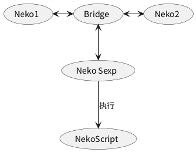

#+TITLE: LiquidNeko架构

* 架构图
#+BEGIN_SRC plantuml :file liquidneko_strcut.png
(Neko1) <-> (Bridge)
(Bridge) <--> (Neko Sexp)
(Bridge) <-> (Neko2)
(Neko Sexp) --> (NekoScript) :执行
#+END_SRC

#+RESULTS:

* 架构思路
** Neko
*** 定义
LiquidNeko架构基本的组成单元，每个Neko都可以看作单个程序、模块或系统的一部分，所有Neko都会有一个统一的通信接口来传递和接收运行S表达式，这个通信接口最好是抽象的，不受协议限制，确保最大兼容性。
此外，每个Neko都应当声明自己支持的模块，并将S表达式依赖的模块声明也随S表达式一起传递，这样方便运行前预检查模块，如果有不支持的则报错。
*** 结构
一个Neko，至少应当拥有下面的实现：
1. 传递S表达式的统一通信接口。
2. 实现或接入一个符合Neko Sexp标准的S表达式解释器。
3. 对实现的NekoScript模块的声明。
*** 核心思想
任何支持 Neko Sexp 标准的程序都可以直接通信和运行相同的脚本，不依赖具体语言或平台。
*** 原理
通过要求每个程序按照标准Neko Sexp标准实现一个扩展解释器，可以很快捷地让这个程序解析并接入Neko Sexp的语法，这样以来每个程序只需要实现一个面向Neko Sexp的扩展，就能互通配置，并都能在这之上运行Neko Sexp的任何脚本。
通过这点，Liquid Neko的协议的基础得以确定，所有LiquidNeko程序可以看做是一个Neko。
借助Liquid标准，可以在任何程序，任何平台兼容并运行同一套S表达式，因为S表达式本身抽象于程序，因此很方便统一各个程序的抽象层表示的上下文配置，或在不同程序中运行由NekoScript写的扩展脚本。

** 脚本(NekoScript)
*** 定义
NekoScript是由Neko统一运行的一系列脚本，NekoScript自身既可以作为上下文存储到S表达式的调用中，又可以作为外置的扩展模块，由其它NekoScript调用。
如果一个程序支持了一个基于NekoScript的模块，那么对等段的程序也会通过搜索内置模块及搜索路径判断否能找到该模块，以此为依据判断然后判断能否运行该表达式。

*** 文件
NekoScript一般是命名为.neko的文件，一个NekoScript也可以看做是一个依赖于SexpNeko的Neko程序。

*** 原理
所有LiquidNeko程序，都通过S表达式互通，且特定S表达式的方法通过各自的方式实现。
而NekoScript，则作为实现互通的桥梁，方便各个程序内部调用一套统一的脚本，来实现程序之间各个工作流的统一。
